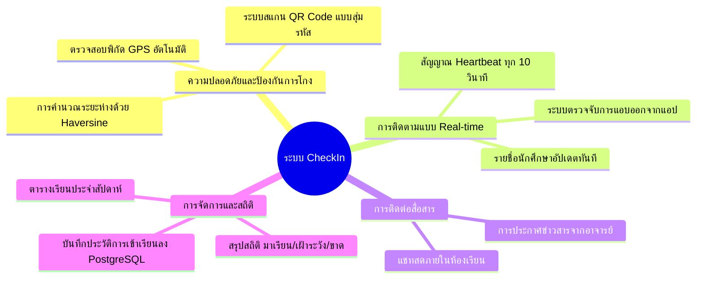

# 📋 เอกสารข้อกำหนดความต้องการของระบบ (SRS - Overview)

## 1. บทนำ (Introduction)
ระบบ **CheckIn** เป็นแพลตฟอร์มเช็คชื่อเข้าชั้นเรียนแบบ Real-time ที่ออกแบบมาเพื่อแก้ไขปัญหาการเช็คชื่อแทนกัน การเข้าเรียนสาย และการขาดการมีส่วนร่วมในห้องเรียน โดยใช้เทคโนโลยีการตรวจจับตำแหน่ง GPS ของอุปกรณ์นักศึกษาเปรียบเทียบกับพิกัดของผู้สอนในห้องเรียน พร้อมทั้งใช้ Dynamic QR Code และรหัสห้องเรียน 6 หลัก

---

## 2. วัตถุประสงค์ของระบบ (System Objectives)
1. **ความถูกต้องและแม่นยำ**: ป้องกันการเช็คชื่อแทนกันโดยกำหนดให้พิกัดของนักศึกษาต้องอยู่ในรัศมีที่ปลอดภัยจากอาจารย์ (ปกติรัศมีไม่เกิน 50 เมตร)
2. **การติดตามความเคลื่อนไหว (Liveness Tracking)**: ส่งสัญญาณชีพจร (Heartbeat) อัปเดตสถานะและพิกัดอย่างต่อเนื่อง ทำให้อาจารย์ทราบได้ทันทีหากนักศึกษาออกจากห้องก่อนหมดเวลา
3. **ลดภาระงานของอาจารย์**: สามารถเปิดคลาส แสดง QR Code บนจอโปรเจกเตอร์ และปิดคลาสพร้อมประมวลผลบันทึกประวัติลงระบบฐานข้อมูลได้ในคลิกเดียว
4. **ความง่ายในการใช้งาน**: รองรับการใช้งานทั้งบนสมาร์ทโฟน แท็บเล็ต และคอมพิวเตอร์ผ่านเว็บเบราว์เซอร์โดยไม่ต้องติดตั้งแอปพลิเคชันจาก App Store

---

## 3. ขอบเขตของระบบ (Project Scope)
- **ระบบยืนยันตัวตนและการเข้าใช้งาน**: รองรับบทบาทอาจารย์ (Teacher) และนักศึกษา (Student)
- **ระบบห้องเรียนเสมือน (Virtual Classroom Session)**: การเปิดห้องเรียน, สุ่มรหัส 6 หลัก, แสดง QR Code
- **ระบบตรวจจับพิกัดทางภูมิศาสตร์ (GPS Geolocation)**: คำนวณระยะทางจากอาจารย์แบบ Real-time
- **ระบบแชทในห้องเรียน (In-class Chat)**: สื่อสารแลกเปลี่ยนข้อความได้ทันที
- **ระบบบันทึกและตรวจสอบประวัติ (Attendance History)**: เก็บบันทึกสถิติเมื่อปิดคลาส
- **ระบบตารางเรียนส่วนบุคคล (Class Schedule)**: จัดการตารางเรียนรายสัปดาห์

---

## เอกสารที่เกี่ยวข้อง
- [[Functional Requirements|ข้อกำหนดเชิงฟังก์ชัน (Functional Requirements)]]
- [[Non-Functional Requirements|ข้อกำหนดที่ไม่ใช่เชิงฟังก์ชัน (Non-Functional Requirements)]]
- [[User Stories & Use Cases|กรณีการใช้งาน (Use Cases)]]
- [[System Architecture|สถาปัตยกรรมระบบ]]
