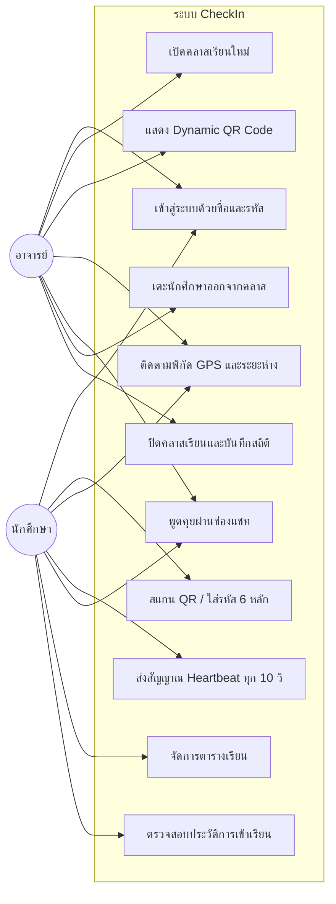

# 👥 กรณีการใช้งานและเรื่องราวของผู้ใช้ (User Stories & Use Cases)

## 1. ผังกรณีการใช้งาน (Use Case Diagram)

---

## 2. เรื่องราวของผู้ใช้ (User Stories)

### ผู้สอน (Teacher Stories)
- **US-T1**: ในฐานะอาจารย์ ฉันต้องการเปิดคลาสเรียนโดยระบุรหัสวิชาและชื่อวิชา เพื่อให้นักศึกษาสามารถเข้าร่วมคาบเรียนปัจจุบันได้
- **US-T2**: ในฐานะอาจารย์ ฉันต้องการให้ระบบสร้าง QR Code และรหัส 6 หลักบนหน้าจอ เพื่อให้นักศึกษาในห้องสามารถสแกนได้สะดวก
- **US-T3**: ในฐานะอาจารย์ ฉันต้องการเห็นรายชื่อนักศึกษาที่อยู่ในห้องเรียนแบบ Real-time พร้อมทั้งระยะห่างจากตัวฉัน เพื่อคัดกรองนักศึกษาที่อยู่นอกห้องเรียน
- **US-T4**: ในฐานะอาจารย์ ฉันต้องการเตะนักศึกษาที่ไม่ได้อยู่ในห้องจริงออกจากคลาสได้ทันที
- **US-T5**: ในฐานะอาจารย์ ฉันต้องการปิดคลาสและบันทึกประวัติการเข้าเรียนลงฐานข้อมูลได้ด้วยการคลิกเพียงครั้งเดียว

### นักศึกษา (Student Stories)
- **US-S1**: ในฐานะนักศึกษา ฉันต้องการเข้าห้องเรียนด้วยการสแกน QR Code หรือพิมพ์รหัส 6 หลัก เพื่อเช็คชื่อได้รวดเร็ว
- **US-S2**: ในฐานะนักศึกษา ฉันต้องการเห็นสถานะระยะห่างของฉันเทียบกับอาจารย์ เพื่อให้มั่นใจว่าระบบบันทึกว่าฉันอยู่ในระยะปลอดภัย
- **US-S3**: ในฐานะนักศึกษา ฉันต้องการส่งข้อความในช่องแชทเพื่อสอบถามหรือแจ้งข้อสงสัยกับอาจารย์ในห้องเรียน
- **US-S4**: ในฐานะนักศึกษา ฉันต้องการดูและจัดการตารางเรียนประจำสัปดาห์ของตนเอง เพื่อเตรียมตัวเข้าเรียน
- **US-S5**: ในฐานะนักศึกษา ฉันต้องการตรวจสอบประวัติการเข้าเรียนย้อนหลัง พร้อมสถิติเปอร์เซ็นต์การเข้าเรียน เพื่อเตรียมพร้อมสำหรับการสอบ

---

## เอกสารเชื่อมโยง
- [[SRS - Overview|SRS ภาพรวม]]
- [[Functional Requirements|ข้อกำหนดเชิงฟังก์ชัน]]
- [[System Architecture|สถาปัตยกรรมระบบ]]
