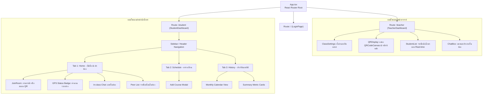
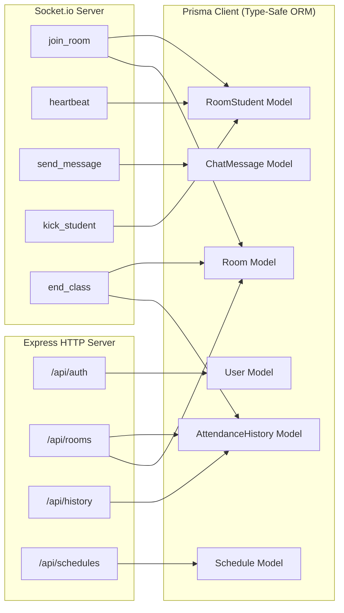

# 🧩 โครงสร้างส่วนประกอบ (Component Architecture)

เอกสารนี้แสดงการจัดวางโมดูลและคอมโพเนนต์ภายในทั้งฝั่ง Frontend และ Backend

---

## 1. แผนผังโครงสร้างซอร์สโค้ด (Source Directory Structure)

```text
my-new-app/
├── docker-compose.yml              # ไฟล์ควบคุมการรันระบบทั้งหมด
├── .env.example                    # ตัวอย่างค่า Environment Variables
├── backend/                        # ฝั่งเซิร์ฟเวอร์ Express.js & Prisma
│   ├── Dockerfile
│   ├── package.json
│   ├── tsconfig.json
│   ├── prisma/
│   │   └── schema.prisma           # โครงสร้างฐานข้อมูล PostgreSQL
│   └── src/
│       ├── index.ts                # จุดเริ่มต้น Express + Socket.io Server
│       ├── prisma.ts               # Prisma Client Singleton
│       ├── routes/
│       │   ├── auth.ts             # REST: เข้าสู่ระบบ / ตรวจสอบสิทธิ์
│       │   ├── rooms.ts            # REST: สร้าง/ดึง/ปิดห้องเรียน
│       │   ├── history.ts          # REST: ประวัติการเช็คชื่อ
│       │   └── schedules.ts        # REST: ตารางเรียนของนักศึกษา
│       └── sockets/
│           └── roomHandler.ts      # WebSocket Event Handlers & Haversine
└── frontend/                       # ฝั่งผู้ใช้ React & Vite
    ├── Dockerfile
    ├── nginx.conf                  # การตั้งค่า Reverse Proxy Nginx
    ├── package.json
    ├── vite.config.ts
    ├── tailwind.config.js
    └── src/
        ├── App.tsx                 # ตัวจัดการเส้นทาง (React Router)
        ├── main.tsx                # จุด Render React DOM
        ├── index.css               # Tailwind CSS & สไตล์หลัก
        ├── lib/
        │   ├── api.ts              # ฟังก์ชันเรียก REST API
        │   └── socket.ts           # การเชื่อมต่อ Socket.io Client
        └── pages/
            ├── LoginPage.tsx       # หน้าเข้าสู่ระบบและเลือกบทบาท
            ├── TeacherDashboard.tsx# หน้าควบคุมคลาสเรียนสำหรับอาจารย์
            └── StudentDashboard.tsx# หน้านักศึกษา (เช็คชื่อ, ตาราง, ประวัติ)
```

---

## 2. โครงสร้างคอมโพเนนต์ฝั่ง Frontend (React Components)



---

## 3. สถาปัตยกรรมฝั่ง Backend (Modular Router & Events)



---

## เอกสารเชื่อมโยง
- [[System Architecture|สถาปัตยกรรมภาพรวม]]
- [[Realtime & GPS Architecture|ระบบ Real-time และการคำนวณ GPS]]
- [[REST & WebSocket API|รายการ API และ Event]]
