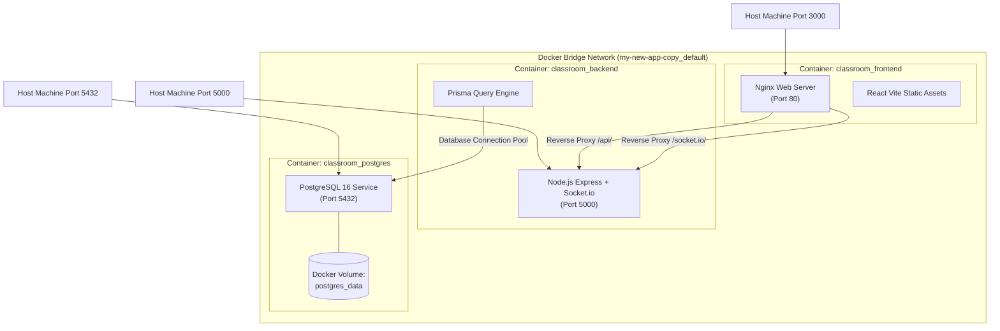

# 🐳 สถาปัตยกรรมคอนเทนเนอร์ & การติดตั้ง (Deployment & Docker)

ระบบ CheckIn ได้รับการออกแบบให้ทำงานบนคอนเทนเนอร์แบบเบ็ดเสร็จ (Fully Containerized) ผ่าน **Docker Compose** เพื่อให้สามารถเริ่มต้นระบบได้ด้วยคำสั่งเดียวบนทุกสภาพแวดล้อม

---

## 1. แผนผังคอนเทนเนอร์และเน็ตเวิร์ก (Docker Network Topology)



---

## 2. รายละเอียดแต่ละคอนเทนเนอร์ (Container Specifications)

### 1. `classroom_postgres` (ฐานข้อมูล)
- **Base Image**: `postgres:16-alpine`
- **Port Mapping**: `5432:5432`
- **Volume**: `postgres_data:/var/lib/postgresql/data` เพื่อรักษาความคงอยู่ของข้อมูล (Data Persistence)
- **Healthcheck**: ใช้คำสั่ง `pg_isready` ตรวจสอบความพร้อมของฐานข้อมูลทุกๆ 5 วินาที

### 2. `classroom_backend` (แอปพลิเคชันแบ็กเอนด์)
- **Base Image**: `node:20-alpine` พร้อมติดตั้ง `openssl`
- **Port Mapping**: `5000:5000`
- **Startup Command**:
  ```bash
  sh -c "npx prisma db push && npx tsx src/index.ts"
  ```
- **Dependency**: ขึ้นตรงกับ `classroom_postgres` โดยจะเริ่มรันเมื่อ Postgres ผ่านสถานะ `healthy` เท่านั้น

### 3. `classroom_frontend` (เว็บเซิร์ฟเวอร์ฟรอนต์เอนด์)
- **Build Process**: Multi-stage Dockerfile
  - **Stage 1 (Build)**: ใช้ `node:20-alpine` ติดตั้ง Dependencies และรัน `npm run build` ผ่าน Vite
  - **Stage 2 (Production)**: ใช้ `nginx:alpine` คัดลอกผลลัพธ์จากไดเรกทอรี `dist` และไฟล์ `nginx.conf`
- **Port Mapping**: `3000:80` (เข้าใช้งานที่ `http://localhost:3000`)

---

## 3. คำสั่งการบริหารจัดการระบบ (Operation Commands)

### เริ่มต้นระบบทั้งหมด:
```bash
docker compose up -d --build
```

### ตรวจสอบสถานะของคอนเทนเนอร์:
```bash
docker compose ps
```

### ดูบันทึกการทำงาน (Logs) ของระบบ:
```bash
docker compose logs -f
```

### หยุดการทำงานของระบบ:
```bash
docker compose down
```

---

## เอกสารเชื่อมโยง
- [[System Architecture|สถาปัตยกรรมระดับสูง]]
- [[Database Schema (ERD)|การเชื่อมต่อฐานข้อมูล Postgres]]
