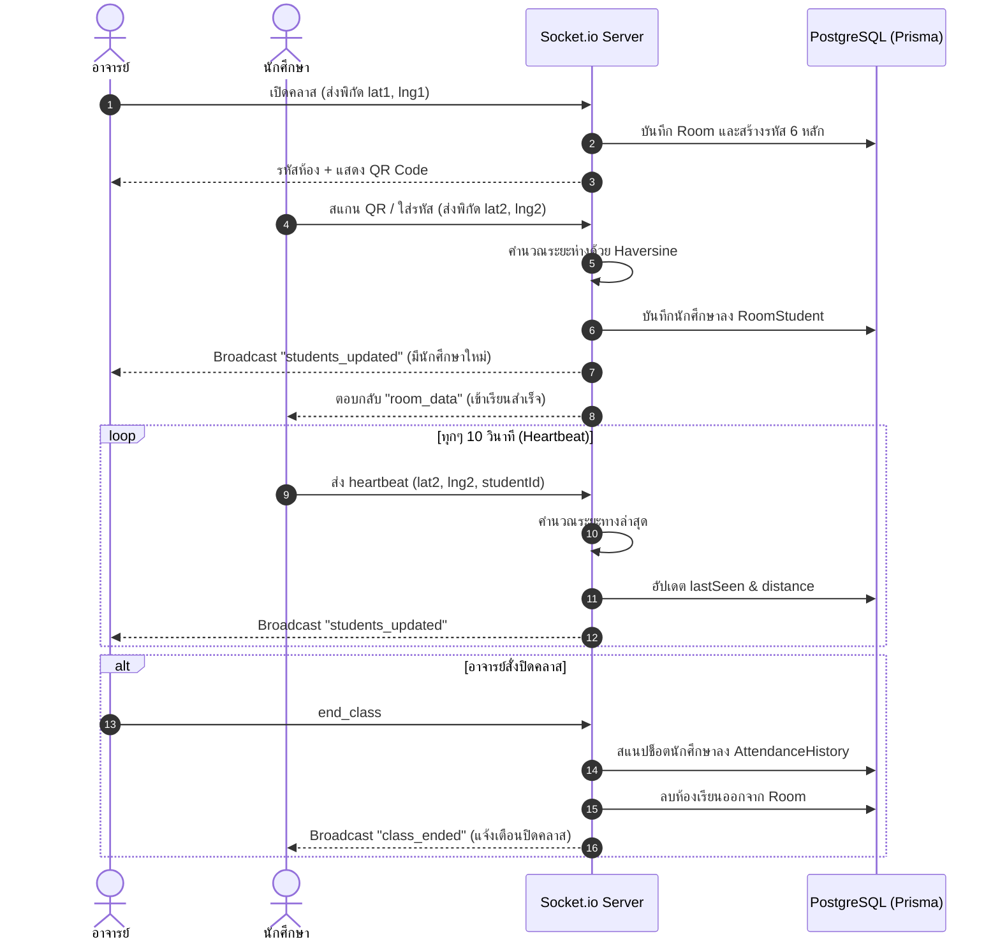
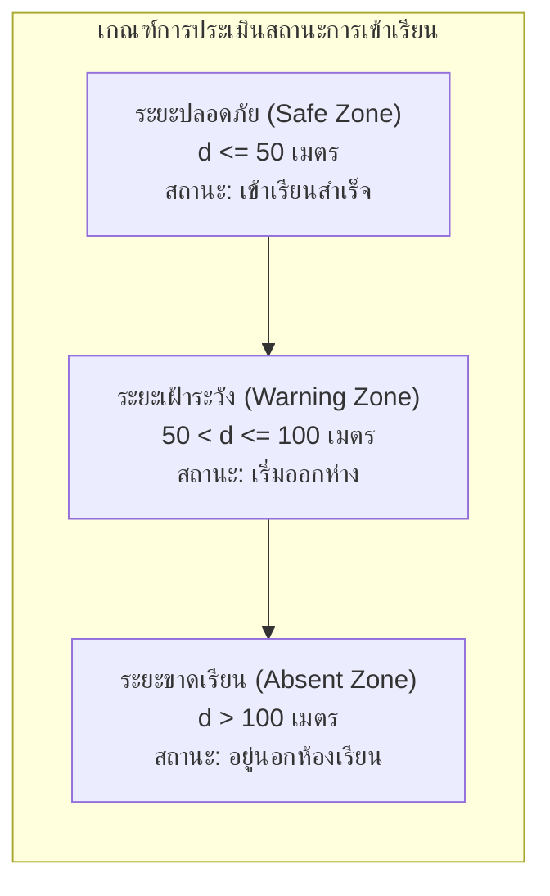

# 📡 สถาปัตยกรรม Real-time & ระบบพิกัด GPS (Realtime & GPS Architecture)

เอกสารนี้เจาะลึกกลไกการสื่อสารสองทิศทางแบบทันที (Bidirectional Real-time) และสูตรคณิตศาสตร์ที่ใช้ในการประเมินตำแหน่งทางภูมิศาสตร์ของนักศึกษา

---

## 1. ลำดับเหตุการณ์การเข้าเรียน (Lifecycle & Sequence Diagram)

---

## 2. สูตรการคำนวณระยะทาง Haversine (Haversine Distance Formula)

เนื่องจากโลกมีลักษณะเป็นทรงกลม การคำนวณระยะห่างระหว่างจุดพิกัด 2 จุดบนผิวโลก ($\text{Latitude}_1, \text{Longitude}_1$) และ ($\text{Latitude}_2, \text{Longitude}_2$) จึงใช้ **สูตรฮาเวอร์ซีน (Haversine Formula)**:

$$\Delta \varphi = \frac{(\text{lat}_2 - \text{lat}_1) \times \pi}{180}$$
$$\Delta \lambda = \frac{(\text{lng}_2 - \text{lng}_1) \times \pi}{180}$$
$$a = \sin^2\left(\frac{\Delta \varphi}{2}\right) + \cos(\varphi_1) \cdot \cos(\varphi_2) \cdot \sin^2\left(\frac{\Delta \lambda}{2}\right)$$
$$c = 2 \cdot \text{atan2}\left(\sqrt{a}, \sqrt{1 - a}\right)$$
$$d = R \cdot c$$

*โดยที่:*
- $R = 6,371,000 \text{ เมตร}$ (รัศมีเฉลี่ยของโลก)
- $d = \text{ระยะห่างในหน่วยเมตร (Meters)}$

### การตีความผลลัพธ์ (Geofencing Thresholds)

---

## 3. ระบบตรวจจับการขาดหายของสัญญาณ (Liveness Detection)
- นักศึกษาแต่ละคนจะส่งคำขอ **Heartbeat** ทุกๆ 10 วินาที
- ฝั่งเซิร์ฟเวอร์จะอัปเดตเวลา `lastSeen`
- ฝั่งอาจารย์จะตรวจสอบ:
  $$\text{Offline Delay} = \text{CurrentTime} - \text{lastSeen}$$
  - หาก $\text{Offline Delay} > 20\text{ วินาที}$: ระบบจะเปลี่ยนไฟสถานะเป็น **สีเหลือง** เพื่อแจ้งให้อาจารย์ทราบว่านักศึกษาอาจปิดแอปพลิเคชันหรือสัญญาณอินเทอร์เน็ตขาดหาย

---

## เอกสารเชื่อมโยง
- [[System Architecture|สถาปัตยกรรมระบบ]]
- [[Database Schema (ERD)|ตาราง RoomStudent และ AttendanceHistory]]
- [[REST & WebSocket API|สเปก WebSocket Event]]
