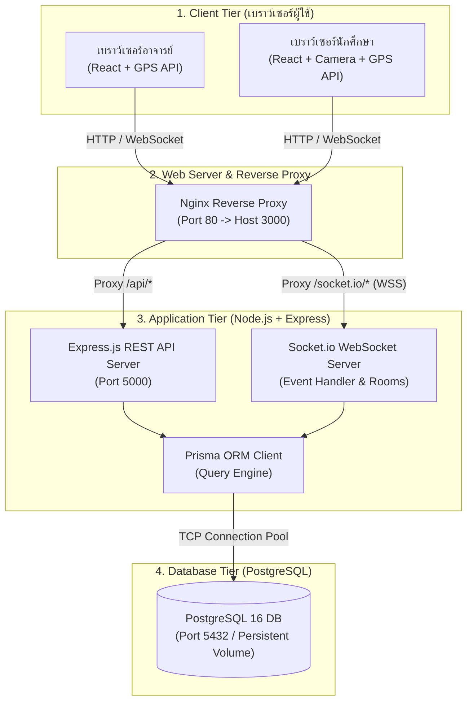

# 🏛️ สถาปัตยกรรมระบบ (System Architecture)

เอกสารนี้อธิบายโครงสร้างสถาปัตยกรรมระดับสูง (High-Level Architecture) ของระบบ CheckIn ซึ่งทำงานบนสถาปัตยกรรมแบบ **Multi-tier Client-Server & Realtime Event-driven Architecture**

---

## 1. ผังสถาปัตยกรรมระดับสูง (High-Level Container Diagram)

---

## 2. คำอธิบายแต่ละชั้นการทำงาน (Architectural Layers)

### 1. Client Tier (Presentation Layer)
- **เครื่องมือ**: React 18, Vite, Tailwind CSS
- **การทำงาน**:
  - แสดงผลส่วนติดต่อผู้ใช้ (UI) แบบตอบสนอง (Responsive)
  - เรียกใช้งาน Web APIs ของระบบปฏิบัติการเครื่องผู้ใช้:
    - **Geolocation API**: ดึงพิกัด $\text{Latitude} / \text{Longitude}$ แบบแม่นยำสูง (`enableHighAccuracy: true`)
    - **MediaDevices API**: เปิดกล้องเพื่อสแกน QR Code (`@yudiel/react-qr-scanner`)
  - เชื่อมต่อกับ Backend ผ่าน **Socket.io Client** เพื่อรับส่งข้อมูลแบบ Real-time และ **Fetch API** สำหรับคำสั่ง CRUD ปกติ

### 2. Edge & Web Tier (Reverse Proxy)
- **เครื่องมือ**: Nginx Alpine Linux
- **หน้าที่**:
  - ทำหน้าที่เป็น Entrypoint หลักของระบบที่พอร์ต 80 (แม็ปออกสู่ภายนอกที่พอร์ต 3000)
  - ให้บริการไฟล์ Static Assets (HTML, CSS, JS) ที่คอมไพล์จาก Vite
  - จัดการ Reverse Proxy คำขอที่ขึ้นต้นด้วย `/api/` ส่งต่อไปยัง `http://backend:5000/api/`
  - รองรับ HTTP Upgrade Header เพื่อเปลี่ยนการเชื่อมต่อเป็น WebSocket สำหรับ `/socket.io/`

### 3. Application Tier (Business Logic Layer)
- **เครื่องมือ**: Node.js 20, Express.js, Socket.io, TypeScript
- **หน้าที่**:
  - **REST API Modules**: จัดการข้อมูลการเข้าสู่ระบบ, การดึงประวัติการเข้าเรียน, และตารางเรียนส่วนบุคคล
  - **Realtime Socket Server**: จัดการ Room Management, การส่งต่อพิกัด Heartbeat, แชทสดในห้อง และการส่ง Event ตัดการเชื่อมต่อเมื่อปิดคลาส
  - **Haversine Math Logic**: คำนวณระยะห่างระหว่างจุดพิกัดของนักศึกษาและอาจารย์

### 4. Data Access & Database Tier
- **เครื่องมือ**: Prisma ORM, PostgreSQL 16 Alpine
- **หน้าที่**:
  - Prisma ทำหน้าที่เป็น Data Mapper แปลง TypeScript Types เข้าสู่โครงสร้างตารางใน PostgreSQL
  - PostgreSQL จัดเก็บข้อมูลแบบสัมพันธ์ (Relational) พร้อมระบบ ACID Transaction ป้องกันข้อมูลสูญหาย

---

## เอกสารเชื่อมโยง
- [[Component Architecture|รายละเอียด Component ในระบบ]]
- [[Realtime & GPS Architecture|การทำงานของ Socket.io และสูตร Haversine]]
- [[Database Schema (ERD)|ผังฐานข้อมูลและ Prisma Schema]]
- [[Deployment & Docker|การติดตั้งและรันระบบด้วย Docker]]
