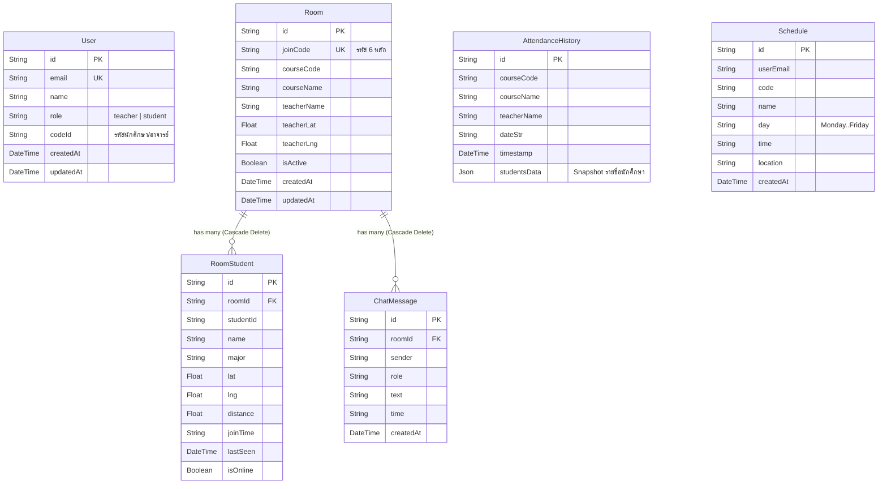

# 🗄️ โครงสร้างฐานข้อมูลและผังความสัมพันธ์ (Database Schema & ERD)

เอกสารนี้แสดงรายละเอียดของโครงสร้างฐานข้อมูล **PostgreSQL** ที่บริหารจัดการผ่าน **Prisma ORM** ในระบบ CheckIn

---

## 1. แผนภาพความสัมพันธ์ของข้อมูล (Entity Relationship Diagram - ERD)



---

## 2. พจนานุกรมข้อมูล (Data Dictionary)

### 2.1 ตาราง `User` (ข้อมูลผู้ใช้งาน)
เก็บบัญชีผู้ใช้งานระบบ ทั้งอาจารย์และนักศึกษา

| ชื่อคอลัมน์ (Field) | ชนิดข้อมูล (Type) | Constraints | คำอธิบาย |
| :--- | :--- | :--- | :--- |
| `id` | `String` | Primary Key, UUID | รหัสประจำตัวระเบียน |
| `email` | `String` | Unique, Not Null | อีเมลของผู้ใช้งาน |
| `name` | `String` | Not Null | ชื่อและนามสกุลจริง |
| `role` | `String` | Not Null | ระดับสิทธิ์: `'teacher'` หรือ `'student'` |
| `codeId` | `String` | Not Null | รหัสนักศึกษา หรือ รหัสประจำตัวบุคลากร |
| `createdAt` | `DateTime` | Default: `now()` | วันเวลาที่สร้างบัญชี |
| `updatedAt` | `DateTime` | Auto-update | วันเวลาที่แก้ไขข้อมูลล่าสุด |

---

### 2.2 ตาราง `Room` (ห้องเรียนที่กำลังเปิดสอน)
เก็บข้อมูลสถานะของคลาสเรียนที่อาจารย์กำลังเปิดทำการสอนแบบสด

| ชื่อคอลัมน์ (Field) | ชนิดข้อมูล (Type) | Constraints | คำอธิบาย |
| :--- | :--- | :--- | :--- |
| `id` | `String` | Primary Key, UUID | รหัสประจำตัวห้องเรียน |
| `joinCode` | `String` | Unique, Not Null | รหัสสุ่ม 6 หลักสำหรับให้นักศึกษาเข้าห้อง |
| `courseCode` | `String` | Not Null | รหัสวิชา เช่น `'CPE101'` |
| `courseName` | `String` | Not Null | ชื่อวิชา เช่น `'Computer Programming'` |
| `teacherName` | `String` | Not Null | ชื่ออาจารย์ผู้สอน |
| `teacherLat` | `Float` | Default: `0` | พิกัดละติจูดของอาจารย์ในห้อง |
| `teacherLng` | `Float` | Default: `0` | พิกัดลองจิจูดของอาจารย์ในห้อง |
| `isActive` | `Boolean` | Default: `true` | สถานะการเปิดสอนของห้อง |
| `createdAt` | `DateTime` | Default: `now()` | เวลาที่เปิดคลาส |
| `updatedAt` | `DateTime` | Auto-update | เวลาที่อัปเดตข้อมูลล่าสุด |

---

### 2.3 ตาราง `RoomStudent` (นักศึกษาในห้องเรียนปัจจุบัน)
เก็บสถานะแบบ Real-time ของนักศึกษาที่กำลังอยู่ในห้องเรียน

| ชื่อคอลัมน์ (Field) | ชนิดข้อมูล (Type) | Constraints | คำอธิบาย |
| :--- | :--- | :--- | :--- |
| `id` | `String` | Primary Key, UUID | รหัสระเบียน |
| `roomId` | `String` | Foreign Key -> `Room.id` (onDelete: Cascade) | รหัสห้องเรียนที่สังกัด |
| `studentId` | `String` | Not Null | รหัสนักศึกษา |
| `name` | `String` | Not Null | ชื่อนักศึกษา |
| `major` | `String` | Default: `'วิศวกรรมคอมพิวเตอร์'` | สาขาวิชา |
| `lat` | `Float` | Default: `0` | พิกัดละติจูดล่าสุดของนักศึกษา |
| `lng` | `Float` | Default: `0` | พิกัดลองจิจูดล่าสุดของนักศึกษา |
| `distance` | `Float` | Default: `0` | ระยะห่างจากอาจารย์ล่าสุด (เมตร) |
| `joinTime` | `String` | Not Null | เวลาที่เข้าร่วมห้องเรียน เช่น `'14:30'` |
| `lastSeen` | `DateTime` | Default: `now()` | เวลาที่ส่งสัญญาณ Heartbeat ล่าสุด |
| `isOnline` | `Boolean` | Default: `true` | สถานะการเชื่อมต่อ |

> **Unique Index**: มีการกำหนด Unique Constraint ร่วมระหว่าง `[roomId, studentId]` เพื่อป้องกันไม่ให้นักศึกษาคนเดียวกันถูกเพิ่มซ้ำในห้องเดียวกัน

---

### 2.4 ตาราง `ChatMessage` (ข้อความแชทในห้องเรียน)
เก็บประวัติการส่งข้อความระหว่างอาจารย์และนักศึกษาภายในคลาส

| ชื่อคอลัมน์ (Field) | ชนิดข้อมูล (Type) | Constraints | คำอธิบาย |
| :--- | :--- | :--- | :--- |
| `id` | `String` | Primary Key, UUID | รหัสข้อความ |
| `roomId` | `String` | Foreign Key -> `Room.id` (onDelete: Cascade) | รหัสห้องเรียนที่สนทนา |
| `sender` | `String` | Not Null | ชื่อผู้ส่งข้อความ |
| `role` | `String` | Not Null | บทบาท: `'teacher'`, `'student'`, หรือ `'system'` |
| `text` | `String` | Not Null | เนื้อหาข้อความ |
| `time` | `String` | Not Null | เวลาที่ส่งข้อความ (ชั่วโมง:นาที) |
| `createdAt` | `DateTime` | Default: `now()` | วันเวลาที่บันทึกข้อความ |

---

### 2.5 ตาราง `AttendanceHistory` (ประวัติการเช็คชื่อเมื่อปิดคลาส)
เมื่ออาจารย์กดปิดคลาสเรียน ข้อมูลสรุปของนักศึกษาทุกคนจะถูกแปลงเป็น JSON และเก็บถาวรในตารางนี้

| ชื่อคอลัมน์ (Field) | ชนิดข้อมูล (Type) | Constraints | คำอธิบาย |
| :--- | :--- | :--- | :--- |
| `id` | `String` | Primary Key, UUID | รหัสประวัติ |
| `courseCode` | `String` | Not Null | รหัสวิชา |
| `courseName` | `String` | Not Null | ชื่อวิชา |
| `teacherName` | `String` | Not Null | ชื่ออาจารย์ |
| `dateStr` | `String` | Not Null | วันที่ภาษาไทย เช่น `'18 ก.ย. 2569'` |
| `timestamp` | `DateTime` | Default: `now()` | วันเวลาที่ปิดคลาส |
| `studentsData` | `Json` | Not Null | รายชื่อนักศึกษา, พิกัด, ระยะห่าง, และเวลาเข้าห้อง |

---

### 2.6 ตาราง `Schedule` (ตารางเรียนประจำสัปดาห์)
เก็บบันทึกวิชาเรียนตามวันของนักศึกษา

| ชื่อคอลัมน์ (Field) | ชนิดข้อมูล (Type) | Constraints | คำอธิบาย |
| :--- | :--- | :--- | :--- |
| `id` | `String` | Primary Key, UUID | รหัสตารางเรียน |
| `userEmail` | `String` | Not Null | อีเมลของนักศึกษาเจ้าของตาราง |
| `code` | `String` | Not Null | รหัสวิชา เช่น `'CPE101'` |
| `name` | `String` | Not Null | ชื่อวิชา |
| `day` | `String` | Not Null | วันในสัปดาห์ (`'Monday'`, `'Tuesday'`, ฯลฯ) |
| `time` | `String` | Not Null | เวลาเรียน เช่น `'09:00 - 12:00'` |
| `location` | `String` | Not Null | อาคารหรือห้องเรียน |
| `createdAt` | `DateTime` | Default: `now()` | เวลาที่บันทึก |

---

## 3. ซอร์สโค้ด Prisma Schema (`schema.prisma`)

```prisma
datasource db {
  provider = "postgresql"
  url      = env("DATABASE_URL")
}

generator client {
  provider = "prisma-client-js"
}

model User {
  id        String   @id @default(uuid())
  email     String   @unique
  name      String
  role      String   // "teacher" | "student"
  codeId    String   // student ID or teacher staff ID
  createdAt DateTime @default(now())
  updatedAt DateTime @updatedAt
}

model Room {
  id          String        @id @default(uuid())
  joinCode    String        @unique // 6-digit room code
  courseCode  String
  courseName  String
  teacherName String
  teacherLat  Float         @default(0)
  teacherLng  Float         @default(0)
  isActive    Boolean       @default(true)
  createdAt   DateTime      @default(now())
  updatedAt   DateTime      @updatedAt
  students    RoomStudent[]
  messages    ChatMessage[]
}

model RoomStudent {
  id        String   @id @default(uuid())
  roomId    String
  room      Room     @relation(fields: [roomId], references: [id], onDelete: Cascade)
  studentId String
  name      String
  major     String   @default("วิศวกรรมคอมพิวเตอร์")
  lat       Float    @default(0)
  lng       Float    @default(0)
  distance  Float    @default(0)
  joinTime  String
  lastSeen  DateTime @default(now())
  isOnline  Boolean  @default(true)

  @@unique([roomId, studentId])
}

model ChatMessage {
  id        String   @id @default(uuid())
  roomId    String
  room      Room     @relation(fields: [roomId], references: [id], onDelete: Cascade)
  sender    String
  role      String
  text      String
  time      String
  createdAt DateTime @default(now())
}

model AttendanceHistory {
  id           String   @id @default(uuid())
  courseCode   String
  courseName   String
  teacherName  String
  dateStr      String
  timestamp    DateTime @default(now())
  studentsData Json
}

model Schedule {
  id        String   @id @default(uuid())
  userEmail String
  code      String
  name      String
  day       String
  time      String
  location  String
  createdAt DateTime @default(now())
}
```

---

## เอกสารเชื่อมโยง
- [[System Architecture|สถาปัตยกรรมระบบ]]
- [[Realtime & GPS Architecture|การคำนวณและอัปเดต RoomStudent]]
- [[REST & WebSocket API|API ที่โต้ตอบกับตารางเหล่านี้]]
